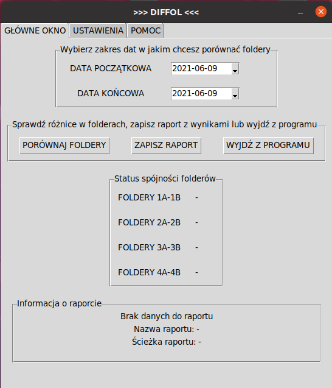
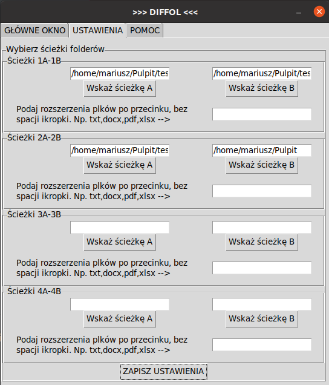
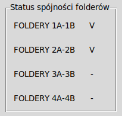
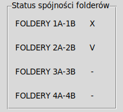
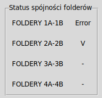
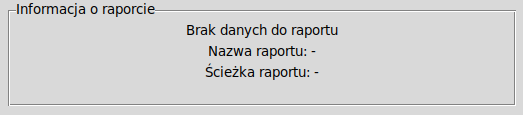
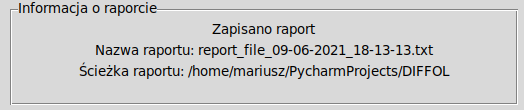
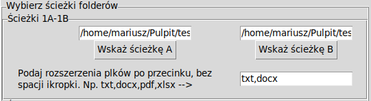
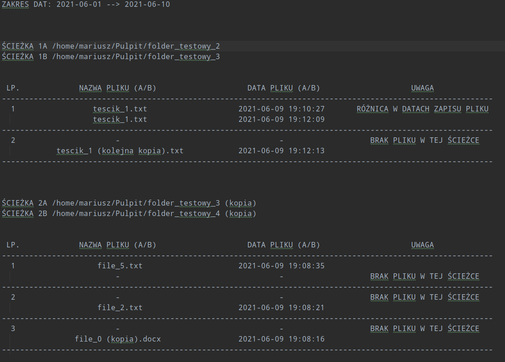

#  DIFFOL

---

## General info

Diffol is a program for comparing the contents of selected folders.
Before checking the differences between folders, you can set the file extensions you want to check and the date range.

After cloning the project on your computer and entering the project folder in the terminal, please enter the command:

    $ pip install -r requirements.txt 

to install all the necessary libraries for the script to run properly.
You should also install a Tkinter.

## Technologies
- Python 3.8
- Tkinter

---
## Description of the application with examples
After starting the program, there are four fields on the main screen, they are:
- calendar field
- main buttons field (compare folders button, save report button, exit program button)
- folder consistency status
- information about the report

There are also tabs:
- main window(visible after starting the program)
- settings

    pic.1 Main view

    pic.2 Settings with entered paths

## Main View

### Calendar field
There are two dates to choose from in the calendar field: start date and end date. By default, they are set to today's 
date. They are the scope for comparing files within folders.

### Main buttons field 

In the field with main buttons, you can compare folders, save a report and exit the program. Before comparing folders 
and saving the report, first go to the settings tab and enter the paths to the folders.

### Folder consistency status
This field shows the overall consistency status of the folders. Possible status is V, X, or Error.

V - no differences,
X - there are differences,
Error - an error from folders.

    pic.3 Folder consistency status - without differences

    pic.4 Folder consistency status - with differences

    pic.5 Folder consistency status - with error

### Information about the report

Information about the report appears in this field. If the "Save report" button is pressed, the name of the report and 
the path to it will appear in this field.

    pic.6 No data for the report

    pic.7 Report saved with name and path.

## Settings
 If no extension is given, 
the program checks all files. After entering the paths and extensions, save the settings with the "Save settings" 
button. Saved settings will be loaded each time the program is started again.

### Paths A - B 

In the settings, we specify the paths to be compared. The program allows you to enter four pairs of paths 
for comparison. For each pair, you can enter the file extensions you want to compare.

    pic.8 Paths with entered extensions.

## Report
The report is made in the form of a txt file. It shows the paths that are compared and then the file pair names,
modification dates, and difference information are displayed in a table.
The information you can expect is:
- no file in one of the compared paths
- difference in file saving dates

    pic.9 Report

